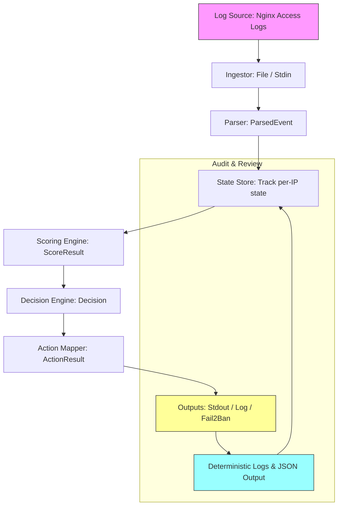
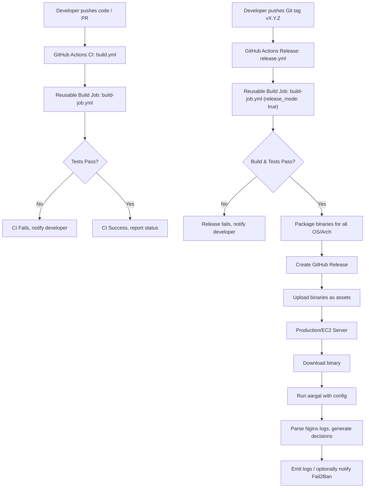

# Aargal

**Aargal (आर्गल)** means *barrier*, *gate*, or *restraint* — a control point that decides what passes through.

**Aargal** is a lightweight, self-hosted, Rust-based log analysis tool for detecting abusive or scraper-like IP behavior from web server logs and feeding enforcement systems such as **Fail2Ban**.

It is designed for operators who want **control, transparency, and predictability** — without cloud lock-in or opaque ML systems.

---

## Target Users

* EC2 / VPS operators
* Self-hosted infrastructure owners
* Nginx + Fail2Ban users
* Developers who want deterministic security controls

---

## Goals

### Phase 1 — Validation / OSS

Phase 1 is intentionally conservative and deterministic:

* Log-based scraper and abuse detection
* Deterministic behavior scoring (no ML)
* IP-based state tracking
* Fail2Ban-compatible output
* CLI-driven workflow
* Minimal runtime dependencies
* Fully self-hosted

This phase is intended to **build trust, validate assumptions, and harden the core logic**.

### Non-Goals (Phase 1)

Explicitly out of scope:

* Packet inspection
* Inline firewall manipulation
* Kernel modules
* Machine learning or AI models
* Cloud services or SaaS components
* Web UI or dashboards

---

## Architecture Overview

Aargal operates as an **out-of-band analyzer**:

1. Ingests Nginx access logs (file or stdin)
2. Parses requests deterministically
3. Tracks per-IP behavior state
4. Scores behavior against fixed thresholds
5. Makes a decision: Allow / Detect / Block
6. Executes output (audit logs, stdout, or Fail2Ban)
7. Delegates enforcement to Fail2Ban (or other side-effects)

---

## Requirements

* Linux (tested on Ubuntu 20.04 / 22.04)
* Rust 1.75+ (stable)
* Nginx access logs
* Fail2Ban (optional but recommended)

---

## Project Structure

```
aargal/
├── aargal.dev.toml       # Development configuration
├── Cargo.lock
├── Cargo.toml
├── README.md
└── src/
    ├── config/
    │   ├── loader.rs     # Loads TOML configuration
    │   ├── mod.rs
    │   └── schema.rs     # TOML schema structs
    ├── engine/
    │   ├── action.rs     # Maps decisions → actions
    │   ├── decision.rs   # Allow / Detect / Block logic
    │   ├── mod.rs
    │   ├── pipeline.rs   # Event processing pipeline
    │   └── scoring.rs    # Behavior scoring
    ├── ingest/
    │   ├── file.rs       # File-based ingestion
    │   ├── stdin.rs      # Std input ingestion
    │   └── mod.rs
    ├── lib.rs            # Library root
    ├── main.rs           # CLI entrypoint
    ├── model/
    │   ├── ip_state.rs   # Individual IP state
    │   ├── mod.rs
    │   └── state_store.rs# IP state store + eviction
    ├── output/
    │   ├── executor.rs   # Executes actions
    │   ├── fail2ban.rs   # Fail2Ban output
    │   ├── log.rs        # Logging output
    │   ├── mod.rs
    │   └── stdout.rs     # Stdout output
    ├── parser/
    │   ├── mod.rs        # Parser root
    │   └── nginx.rs      # Nginx log parser
    └── util/             # Helper functions
```

---

## Configuration

Aargal uses a **TOML configuration file**.

### Development configuration

Recommended path during development:

```toml
# aargal.dev.toml
[general]
mode = "detect"
state_ttl_seconds = 3600

[ingest]
source = "file"
path = "/var/log/nginx/access.log"
poll_interval_ms = 1000

[parser]
format = "nginx_combined"
ignore_status = [200, 304]

[scoring]
threshold = 100
weights = { rate = 50, error = 30, user_agent = 10, path_entropy = 10 }

[actions]
on_block = "log"

[fail2ban]
enabled = true
socket = "/var/run/fail2ban/fail2ban.sock"
jail = "nginx-attackers"

[logging]
level = "info"
json = false
```

Run with:

```bash
cargo run -- --config ./aargal.dev.toml
```

### Production configuration (planned)

```
/etc/aargal/aargal.toml
```

Configuration must be explicit — no auto-discovery is used.

---

## Build & Test

### Build

```bash
cargo build --release
```

### Sanity check

```bash
cargo check
```

Expected output:

```
Finished `dev` profile [unoptimized + debuginfo]
```

### Unit tests

Run all tests:

```bash
cargo test --lib
```

Expected output:

```
running 25 tests
test result: ok. 25 passed; 0 failed; 0 ignored
```

This ensures pipeline, scoring, decision, and output modules are functioning correctly.

---

## Running Aargal

1. Prepare your config file (`aargal.dev.toml` for development).
2. Start Aargal:

```bash
cargo run -- --config ./aargal.dev.toml
```

3. It will begin **ingesting logs** (file or stdin), **updating IP state**, and **making decisions**.

---

## Observing Impact / Output

Aargal’s output depends on the configured actions:

* **Stdout / logs**: You will see per-event decisions in console logs.
* **Fail2Ban**: IP addresses exceeding thresholds will be emitted to Fail2Ban via socket.
* **Audit**: All scoring and decision data is deterministic and can be printed/logged for review.

Sample stdout output:

```
[INFO] IP 192.168.1.101 scored 120, decision: Block
[INFO] Action executed: log + fail2ban
```

Fail2Ban will then take action according to its configuration (ban IPs).

---

## Integration Model

### With Nginx

* Aargal reads existing access logs.
* No Nginx module required.
* No request-path interference.

### With Fail2Ban

* Aargal emits Fail2Ban-compatible log entries.
* Fail2Ban owns banning and escalation.
* Aargal does **not modify firewall state directly** in Phase 1.

---

## Explainability & Auditability

Every enforcement decision is traceable:

* IP address
* Triggering conditions
* Scoring breakdown
* Timestamp
* Output classification

This enables post-incident audits and tuning without guesswork.

---

## License

Dual-licensed:

* **Apache License 2.0**
* **MIT License**

Choose either.

---

## Project Status

* Phase: **1 — Validation / OSS**
* Stability: **Early, actively developed**
* API: **Unstable**
* Config schema: **Subject to change until Phase 1 lock**

---

## Guiding Principles

* Determinism over heuristics
* Explainability over automation
* OSS-first development
* Minimalism over feature sprawl

---

## Example Run & Output

Assume you have a development config at `./aargal.dev.toml` pointing to your Nginx access log.

### Step 1 — Start Aargal

```bash
cargo run -- --config ./aargal.dev.toml
```

### Step 2 — Sample Logs Being Ingested

Example lines from `/var/log/nginx/access.log`:

```
192.168.1.101 - - [23/Dec/2025:10:15:23 +0000] "GET /login HTTP/1.1" 200 512 "-" "Mozilla/5.0"
192.168.1.102 - - [23/Dec/2025:10:15:24 +0000] "GET /admin HTTP/1.1" 403 256 "-" "curl/7.68.0"
192.168.1.101 - - [23/Dec/2025:10:15:25 +0000] "GET /login HTTP/1.1" 200 512 "-" "Mozilla/5.0"
```

Aargal parses each line and constructs `ParsedEvent` objects.

---

### Step 3 — IP State Tracking

Aargal maintains per-IP state including:

* Request count
* Error count
* First/last seen timestamps
* Suspicious paths or user agents

For example:

```
IP 192.168.1.101
  Requests: 2
  Errors: 0
  Suspicious paths: none
  User-agent: Mozilla/5.0
```

```
IP 192.168.1.102
  Requests: 1
  Errors: 1
  Suspicious paths: /admin
  User-agent: curl/7.68.0
```

---

### Step 4 — Behavior Scoring

Aargal calculates a `ScoreResult` for each IP:

```
ScoreResult for 192.168.1.101: 50 (below threshold)
ScoreResult for 192.168.1.102: 120 (above threshold)
```

Weights are applied per configuration:

* `rate` → number of requests
* `error` → number of 4xx/5xx responses
* `user_agent` → suspicious agents
* `path_entropy` → unusual or admin paths

---

### Step 5 — Decision Making

Based on `ScoreResult` and `GeneralConfig.mode`:

* **Allow** → no action
* **Detect** → log only
* **Block** → log + Fail2Ban (if enabled)

Example output:

```
[INFO] IP 192.168.1.101 scored 50 → Decision: Allow
[INFO] IP 192.168.1.102 scored 120 → Decision: Block
```

---

### Step 6 — Action Execution

Depending on configuration (`ActionsConfig` + `Fail2BanConfig`):

* `ActionResult::None` → nothing
* `ActionResult::DetectOnly` → log to stdout
* `ActionResult::Block` → log + Fail2Ban command

Example stdout / log output:

```
[INFO] Executing action: Block(Log + Fail2Ban) for IP 192.168.1.102
[INFO] Fail2Ban command: set aargal-auto banip 192.168.1.102
```

Fail2Ban will then **ban the offending IP** according to its jail configuration.

---

### Step 7 — Audit & Review

All decisions are **deterministic and auditable**:

```
{
  "ip": "192.168.1.102",
  "score": 120,
  "decision": "Block",
  "reason": ["High request rate", "Suspicious path /admin"],
  "timestamp": "2025-12-23T10:15:25Z",
  "action": "Fail2Ban"
}
```

This ensures:

* Post-incident review
* Rule tuning without guesswork
* Traceability for compliance

---

### Step 8 — Continuous Operation

Aargal continuously tails the log (or reads stdin), updating states and enforcing actions in **real-time**.

*State eviction* occurs according to `GeneralConfig.state_ttl_seconds`, ensuring memory usage stays bounded.

---


Perfect! Here’s a **Mermaid diagram** for your README showing Aargal’s end-to-end flow. You can embed this directly in the Markdown (`README.md`) for clarity.



### Explanation of Flow

1. **Log Source** – Nginx or other supported logs.
2. **Ingestor** – Reads new log lines from file or stdin.
3. **Parser** – Converts raw lines into structured `ParsedEvent` objects.
4. **State Store** – Tracks per-IP metrics: counts, errors, paths, timestamps.
5. **Scoring Engine** – Computes `ScoreResult` based on weights and thresholds.
6. **Decision Engine** – Determines `Decision` (`Allow`, `Detect`, `Block`) per IP.
7. **Action Mapper** – Converts `Decision` into `ActionResult` (logging, Fail2Ban).
8. **Outputs** – Writes logs, stdout, or triggers Fail2Ban as configured.
9. **Audit & Review** – All actions are deterministic, logged, and can feed back into monitoring or tuning.

---

# **Aargal CI/CD — GitHub Actions**

This section describes how the **build and release automation** works for the `aargal` Rust project.

---

## **Overview**

`aargal` uses **GitHub Actions** for:

1. **Continuous Integration (CI)** — building and testing on multiple OS + architectures.
2. **Continuous Deployment / Release (CD)** — building release binaries and publishing GitHub releases automatically.

**Design Principles:**

* **Modular workflows:** Reusable build job is shared between CI and release.
* **Multi-platform:** Supports `ubuntu-22.04` and `ubuntu-20.04`, `x86_64` and `aarch64`.
* **Deterministic releases:** Release triggered by Git tag push (`vX.Y.Z`).
* **Artifact-based:** Binaries are uploaded as release assets.

---

## **Folder Structure**

```
.github/
└── workflows/
    ├── build.yml           # CI workflow (build + test)
    ├── release.yml         # Release workflow (build + GitHub release)

```


* `build.yml` contains the actual build/test steps and handles multiple OS + arch.
* `release.yml` calls the reusable workflow in **release mode** and publishes a GitHub release.

---

## **Reusable Build Workflow**

**Capabilities:**

* Installs Rust toolchain.
* Caches `Cargo` dependencies and build outputs.
* Builds the project in release mode.
* Runs unit tests.
* Optionally packages binaries for release (`release_mode: true`).

---

## **CI Workflow (build.yml)**

* Triggered on:

  * Push to `main` or `dev`.
  * Pull requests.

* Runs tests but **does not upload release binaries**.

* Uses the reusable build workflow.

---

## **Release Workflow (release.yml)**

* Triggered **only on tag push**, e.g., `v0.1.0`.
* Steps:

  1. Calls reusable build workflow with `release_mode: true`.
  2. Downloads generated binaries.
  3. Creates a GitHub release using `softprops/action-gh-release`.
  4. Uploads binaries as release assets.

---

## **How to Tag & Release**

1. Ensure your local repository is up-to-date:

```bash
git fetch origin
git checkout main
git pull
```

2. Create a release tag:

```bash
git tag -a v0.1.0 -m "Release v0.1.0"
git push origin v0.1.0
```

3. GitHub Actions will automatically:

* Build and test the project on all defined OS + architectures.
* Package release binaries.
* Create a GitHub release with binaries attached.

---

## **Expected Release Artifacts**

For each OS/arch combination:

```
aargal-ubuntu-22.04-x86_64
aargal-ubuntu-22.04-aarch64
aargal-ubuntu-20.04-x86_64
aargal-ubuntu-20.04-aarch64
```

* Binaries are placed as **assets** under the GitHub release page.
* Users can download the appropriate binary for their system.

---

## **Manual Deployment from Release**

1. SSH into your server (EC2 or VPS).
2. Download the appropriate binary:

```bash
wget https://github.com/<org>/aargal/releases/download/v0.1.0/aargal-ubuntu-22.04-x86_64
chmod +x aargal-ubuntu-22.04-x86_64
sudo mv aargal-ubuntu-22.04-x86_64 /usr/local/bin/aargal
```

3. Run `aargal` with your configuration:

```bash
aargal --config /etc/aargal/aargal.toml
```

4. Monitor logs or integrate with Fail2Ban:

* Nginx logs are parsed.
* Decisions (Allow / Detect / Block) are logged and optionally sent to Fail2Ban.

---

## **Benefits**

* **No Rust setup required on production server.**
* **Multi-platform builds** handled automatically.
* **Reproducible releases** with attached binaries.
* **Modular workflows** reduce duplication and simplify maintenance.

---




**Explanation of the flow:**

1. **CI (`build.yml`)**:

   * Triggered by pushes or PRs.
   * Uses **reusable build job** to compile and run tests.
   * Reports success/failure in PR status.

2. **Release (`release.yml`)**:

   * Triggered by **Git tag push**.
   * Calls **reusable build job** in release mode.
   * Packages binaries and attaches them to the GitHub release.

3. **Deployment**:

   * Production server downloads the binary from GitHub release.
   * Runs `aargal` with the specified config.
   * Processes Nginx logs and optionally triggers Fail2Ban actions.

---

## Installation

Aargal is distributed as a **precompiled Linux binary** via GitHub Releases.
No Rust toolchain is required on the target server.

> **Supported platforms**
>
> * Linux (Ubuntu 20.04 / 22.04 tested)
> * Architectures:
>
>   * `x86_64` (Intel / AMD)
>   * `aarch64` (ARM, e.g. AWS Graviton)
>
> macOS and Windows are **not supported** in Phase 1.

---

### 1. Quick Install (Recommended)

Use the official install script hosted in this repository.

```bash
curl -fsSL https://raw.githubusercontent.com/urwithajit9/aargal/main/scripts/install.sh | sh
```

What this does:

1. Detects OS and CPU architecture
2. Downloads the correct release binary
3. Verifies the archive
4. Installs `aargal` to `/usr/local/bin`
5. Makes it executable

After installation:

```bash
aargal --version
```

---

### 2. Install a Specific Version

By default, the installer fetches the **latest release**.

To install a specific version:

```bash
AARGAL_VERSION=v0.1.3 \
curl -fsSL https://raw.githubusercontent.com/urwithajit9/aargal/main/scripts/install.sh | sh
```

---

### 3. Manual Installation (Advanced / Offline)

If you prefer not to use the install script:

1. Download the release archive from GitHub:

```bash
curl -LO https://github.com/urwithajit9/aargal/releases/download/v0.1.3/aargal-v0.1.3-linux-x86_64.tar.gz
```

2. Extract the binary:

```bash
tar -xzf aargal-v0.1.3-linux-x86_64.tar.gz
```

3. Move it into your PATH:

```bash
sudo mv aargal /usr/local/bin/
sudo chmod +x /usr/local/bin/aargal
```

4. Verify:

```bash
aargal --help
```

---

### 4. Architecture Detection (Troubleshooting)

To determine which binary you need:

```bash
uname -s
uname -m
```

Expected values:

| Output    | Meaning                  |
| --------- | ------------------------ |
| `Linux`   | Supported OS             |
| `x86_64`  | Intel / AMD              |
| `aarch64` | ARM (AWS Graviton, etc.) |

---

### 5. Configuration

Create a configuration file:

```bash
sudo mkdir -p /etc/aargal
sudo cp aargal.dev.toml /etc/aargal/aargal.toml
```

Edit as needed:

```bash
sudo nano /etc/aargal/aargal.toml
```

---

### 6. Running Aargal

Run manually for testing:

```bash
aargal --config /etc/aargal/aargal.toml
```

Typical usage is as a **long-running process** (systemd service recommended in future releases).

---

### 7. Where to See the Impact

Once running, Aargal will:

* Read Nginx access logs
* Detect abusive behavior
* Emit actions based on mode:

  * **Detect mode** → logs only
  * **Enforce mode** → Fail2Ban integration

Verify effects via:

```bash
sudo fail2ban-client status
sudo fail2ban-client status <jail>
```

And logs:

```bash
journalctl -u fail2ban
```

---

### 8. Uninstall

```bash
sudo rm /usr/local/bin/aargal
sudo rm -rf /etc/aargal
```

---

## Notes for Operators

* Aargal **never modifies firewall rules directly**
* All enforcement is delegated to Fail2Ban
* Safe to deploy alongside existing setups
* Designed for deterministic, auditable behavior


