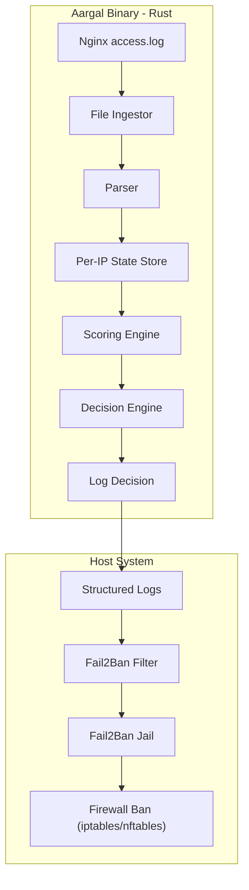

# Architecture

This document describes how **Aargal** works internally, from log ingestion to enforcement.

Aargal is an **out-of-band**, deterministic analysis engine.
It does **not** intercept traffic inline and does **not** manipulate firewall rules directly.

---

## High-Level Design

Aargal processes logs in a continuous pipeline:

1. Read log entries (file or stdin)
2. Parse structured request data
3. Track per-IP behavior
4. Score behavior deterministically
5. Make a decision
6. Emit actions (logs / Fail2Ban)

---

## Runtime Flow

```mermaid
flowchart TD
    A[Nginx access.log] --> B[File Ingestor]
    B --> C[Parser]
    C --> D[Per-IP State Store]
    D --> E[Scoring Engine]
    E --> F[Decision Engine]

    F -->|Allow| G[No Action]
    F -->|Detect| H[Structured Log]
    F -->|Block| I[Fail2Ban Command]

    I --> J[Fail2Ban Socket]
    J --> K[Fail2Ban Jail]
    K --> L[Firewall Ban]
````

---

## Key Architectural Principles

### Determinism

* No ML models
* No probabilistic decisions
* Same inputs always produce the same outputs

### Explainability

Every decision can be traced back to:

* Score
* Threshold
* Rule
* Timestamp

### Separation of Concerns

| Component | Responsibility        |
| --------- | --------------------- |
| Aargal    | Detection & signaling |
| Fail2Ban  | Enforcement           |
| Firewall  | Blocking              |

---

## Why Out-of-Band?

* Zero impact on request latency
* No Nginx module required
* Safe to deploy incrementally
* Easy rollback

---

## State Model

* Per-IP state
* TTL-based eviction
* Bounded memory usage
* Stateless across restarts (Phase 1)

---

## Failure Model

* Parser errors are logged, not fatal
* Missing logs → warnings
* Fail2Ban unavailable → detection continues


## Runtime Flow
```mermaid

flowchart TD
    A[Developer pushes code / PR] --> B[GitHub Actions CI]
    B --> C[Reusable build.yml]
    C --> D{Tests pass?}
    D -- No --> E[CI fails]
    D -- Yes --> F[Build success]

    A2[Developer pushes tag vX.Y.Z] --> G[Release workflow]
    G --> H["Build release binaries (Release Mode)"]
    H --> I[Create GitHub Release]
    I --> J[Attach tar.gz assets]

    J --> K[User runs install.sh]
    K --> L[Download correct binary]
    L --> M[Install /usr/local/bin/aargal]
    M --> N[Install config + service]
    N --> O[systemd starts aargal]

    O --> P[aargal daemon running]

```



See also:
- [Configuration](configuration.md)
- [Fail2Ban Integration](fail2ban.md)
