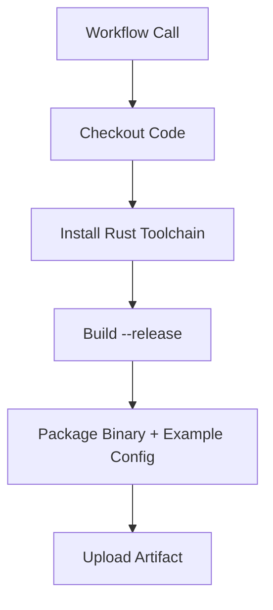
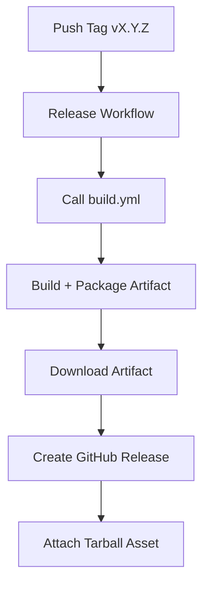

# CI/CD & Releases

Aargal uses **GitHub Actions** for continuous integration and automated releases. The pipeline is intentionally minimal and deterministic, mirroring Aargal’s design philosophy: build once, ship immutable artifacts, and avoid runtime surprises.

This document reflects the **current build and release process**, including the introduction of a packaged configuration example (`config/aargal.example.toml`) alongside the binary.

---

## Goals of the Pipeline

* Deterministic, reproducible builds
* No runtime compilation on user machines
* Release artifacts suitable for `curl | sh` installation
* Clear separation between **build** and **release** responsibilities

---

## Workflow Layout

```text
.github/workflows/
├── build.yml     # Reusable build workflow
└── release.yml   # Tag-driven release workflow
```

---

## Build Workflow (`build.yml`)

The **build workflow** is reusable and is invoked by other workflows (not directly by pushes).

### Responsibilities

* Check out the repository
* Install the Rust toolchain
* Build the Aargal binary in `--release` mode
* Assemble a release-ready tarball containing:

  * `aargal` binary
  * `config/aargal.example.toml`
* Upload the tarball as a workflow artifact

### Why include the example config?

The configuration file:

* Is **not embedded** into the binary
* Must live outside `src/`
* Is required by `install.sh` for first-time installs

Packaging it at build time ensures:

* Installer reliability
* Version-aligned defaults
* No assumptions about repository layout on user machines

---

## CI Flow (Build Only)



---

## Release Workflow (`release.yml`)

The **release workflow** is triggered automatically when a version tag is pushed.

### Trigger

```text
git tag vX.Y.Z
git push origin vX.Y.Z
```

Only tags matching `v*.*.*` will trigger a release.

---

### Responsibilities

1. Invoke `build.yml` with the release tag
2. Download the packaged artifact
3. Verify the artifact contents
4. Create a GitHub Release
5. Attach the tarball as a release asset

The release workflow does **not** rebuild the project itself. All builds flow through the same build logic.

---

## Release Flow



---

## Release Artifacts

Each GitHub Release contains:

```text
aargal-vX.Y.Z-linux-x86_64.tar.gz
```

Contents:

```text
aargal
config/
└── aargal.example.toml
```

This layout is relied upon by `install.sh`.

---

## Installer Compatibility

The CI/CD pipeline guarantees that:

* The binary name is stable (`aargal`)
* The example configuration path is stable
* The archive format is consistent

This allows the installer to:

* Copy the example config to `/etc/aargal/aargal.toml` if missing
* Preserve existing user configuration on upgrades

---

## What CI/CD Does NOT Do

* Publish Docker images
* Cross-compile for non-Linux targets
* Push packages to OS repositories
* Auto-update running systems

These are intentionally deferred to later phases.

---

## Local Release (Maintainers)

```bash
git tag -a v0.1.0 -m "Release v0.1.0"
git push origin v0.1.0
```

Once pushed:

* CI builds the artifact
* GitHub Release is created
* `install.sh` can immediately consume the release

---

## Summary

| Aspect       | Behavior                |
| ------------ | ----------------------- |
| Build        | GitHub Actions          |
| Artifact     | Binary + example config |
| Trigger      | Git tag                 |
| Determinism  | High                    |
| Runtime deps | None                    |


